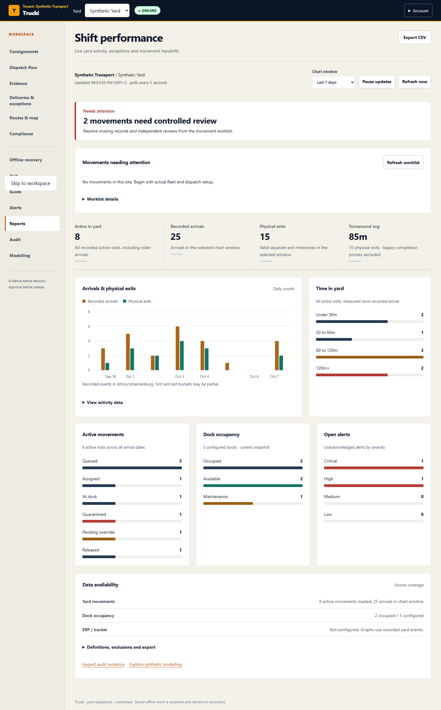
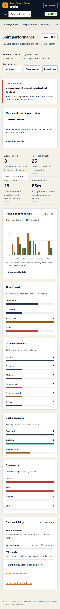

# Live operational dashboard

Implemented locally on 7 October 2026. Frontend and backend must be deployed together. This change does not configure ERP or tracker providers and does not claim predictive accuracy or verified legal/financial outcomes.

## Operator experience

Reports now includes five graphs: recorded arrivals versus physical exits, time in yard, active movement statuses, current dock occupancy and open alert severity. Select a rolling 24-hour, seven-day or 30-day activity window. Current-state graphs always include all eligible active records, including visits that began before the activity window.

The dashboard polls every five seconds while the tab is visible. Pause retains the last snapshot and labels it paused; resume continues polling. Manual refresh reloads the selected scope. Failed reads retain any last successful graphs with an explicit stale warning. Initial loading never reports an empty yard. A 12-second request timeout prevents a hung request from blocking subsequent polls indefinitely.

No chart animation is required. Activity buckets support keyboard focus, count descriptions and a readable data table. Responsive graphs were inspected at desktop and 390px mobile widths. Synthetic practice charts remain explicitly labelled, and are never substituted after a live read fails.

The existing visit CSV export is retained, including the original practice visit fixtures. A separate chart CSV contains aggregated activity counts, timestamps, site timezone and metric version. Both are disabled when the displayed snapshot is stale or unavailable.

## Data contract

`GET /api/reports/dashboard/?facility=<assigned-site-id>&window=24h|7d|30d`

- Uses current Django staff authentication and reports read permissions, with assigned-site resolution and an additional yard read check.
- Tenant and site predicates apply to every aggregate. Dock and alert figures respect their read permissions; inaccessible figures are null, not measured zero.
- Returns aggregates only, with at most 25 hourly or 32 daily buckets. It does not download every visit to the browser to calculate charts. Historical aggregate scans are bounded to a maximum 30-day window; current active counts are deliberately not date-truncated.
- `as_of` is the server calculation time. It establishes when Trucki read its records, not when an external tracker last observed a vehicle. The response is private and not cacheable.
- Physical exits and their turnaround sample include only SEPARATE_V1 records whose exit is no earlier than arrival and no later than calculation time. Legacy completion/release proxies are excluded and disclosed.
- Arrivals and exits use their own event times in the selected rolling window. The first and last time buckets may be partial. The same trip need not arrive and exit in the same window, so subtracting these two series does not establish historical occupancy.
- Hour bins retain distinct UTC instants across daylight-saving folds; labels use the site's timezone. Daily bins follow the site's calendar days.
- Active means recorded arrival is not in the future and no exit is recorded, excluding uncertain legacy COMPLETED/RELEASED records. Released SEPARATE_V1 visits without physical exit remain active.
- Time in yard is elapsed time since arrival, not proven wait for a dock or duration of a particular blocker. The age bands are descriptive intervals, not statutory or tenant SLA limits.
- Dock occupancy is a point-in-time count, not occupied dock-minutes divided by available dock-minutes. Open alerts are unacknowledged records, not an exhaustive list of all unresolved exceptions.
- Source coverage includes excluded legacy completions, invalid exit timestamps within the window, future arrivals and latest yard-record modification. These are data-quality disclosures, not guarantees that all business events were captured.

The report no longer consumes the disconnected Firebase heatmap/surge client. Legacy analytics files remain elsewhere in the repository and have not been declared a working integration. The existing movement worklist retains its own explicit refresh control; its handoff view is separate from the five-second chart feed and still has its documented latest-100-visit limit.

## Validation

- Eight new backend cases cover empty data, authoritative exit semantics, old active records beyond 100 visits, tenant/site isolation, restricted roles, bounded windows, site midnight and daylight-saving folds.
- Existing admin dashboard, reports/export and operations workspace tests are retained and exercised alongside the new cases.
- Four frontend unit cases cover invalid input rejection, site/window mismatch, unknown duration and CSV provenance. The complete frontend unit suite passes 105 cases.
- Seven Chromium interface checks cover dashboard loading, window selection, keyboard access, desktop/mobile layout, polling, pause/resume, failure/staleness, exports and the existing inspection hierarchy.
- Two additional practice checks preserve the existing visit CSV and practice Reports workflow.
- Production build passes. The remaining lint warning is the existing shared-ui Fast Refresh warning.

Screenshots use intercepted synthetic API fixtures, not customer performance:

## Remaining intelligence work

Configure actual integration providers after customer discovery. Record hold/handoff episodes before presenting time-by-cause charts. Calibrate ETA and capacity forecasts against real outcomes before adding predictive graphs. Configure agreed tenant service targets before labelling age-band breaches as operational SLA failures. Production load testing and signed-in verification remain outstanding. The deployed release and read-only smoke results are recorded in [DEPLOYMENT_2026-10-07_DASHBOARD.md](DEPLOYMENT_2026-10-07_DASHBOARD.md).
