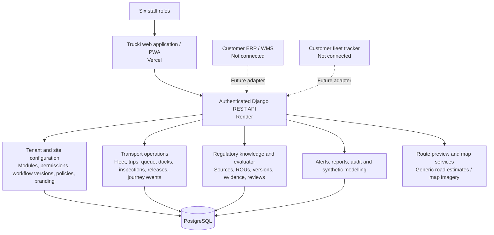
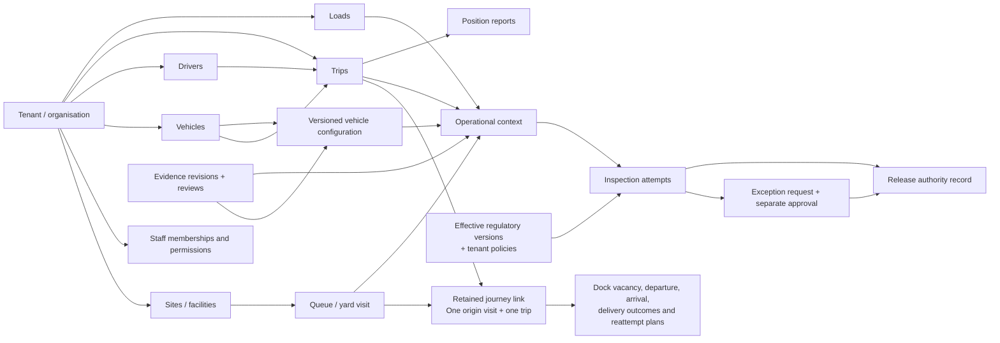

# Trucki: current system map

Implementation snapshot: 7 October 2026. Based on the current application routes, API routes, service permissions and deployment evidence. This is an implementation map, not a new production acceptance run. BAK Logistics is the configured reference tenant. Trinitas has not been configured.

## 1. System boundary

Solid arrows represent implemented application paths. Dotted arrows represent unconfigured external integration boundaries. Generic route estimates do not establish heavy-vehicle suitability or regulatory clearance. A manually recorded dispatch reference is not an ERP import or acknowledgement.

## 2. User and screen map

| Screen | Route | Default staff access | Current purpose |
| --- | --- | --- | --- |
| Sign-in | `/` | All staff | Staff ID/PIN or email/password; bounded access sessions with renewal |
| Shift queue | `/queue` | Dispatch, Operations, Facility Manager | Register arrivals, inspect status, open a visit for checks, perform eligible release |
| Dock board | `/docks` | Operations, Facility Manager | Allocate docks and manage yard occupancy |
| Operational inspection | `/compliance?entry=ID` | Dispatch, Operations, Facility Manager | Prepare context, inspect evidence, record inspection as Dispatch, review eligible exceptions as Operations |
| Routes and map | `/routes` | All six roles | Preview/save assigned route drafts where permitted; inspect trip evidence, positions and connected journeys |
| Alerts | `/alerts` | All six roles | View operational alerts; Operations, Facility Manager and Admin can acknowledge where permitted |
| Reports | `/reports` | Operations, Facility Manager, Executive, Admin | Review operational performance and export report data |
| Audit | `/audit` | Compliance Officer, Facility Manager, Executive, Admin | View audit events; Admin and Compliance Officer can open the vehicle evidence register |
| Synthetic modelling | `/modelling` | Facility Manager, Executive, Admin | Reproducible invented scenarios; no operational writes or verified-law claims |
| Administration | `/admin` | Admin | Fleet registration, vehicle evidence, tenant settings and versioned configuration |
| Hub and guide | `/hub`, `/guide` | All six roles | Navigation and operating guidance |

Tenant modules, role enablement, permission restrictions and site membership can narrow access. Backend checks govern writes. Screen access does not grant every action on that screen. Only assigned Admin accounts can switch working roles. Independent review requires a different user, not merely a different selected role.

## 3. Operational workflow and handoffs

```mermaid
flowchart TD
    Master["Admin registers vehicle and driver<br/>Rating document + configuration receive independent review"] --> Assignment["Assigned trip and route<br/>Dispatch / Operations / Facility / Admin where permitted"]
    Arrival["Arrival registered<br/>Dispatch / Operations"] --> Visit["Origin yard visit"]
    Visit --> Dock["Dock assignment<br/>Operations / Facility Manager"]
    Assignment --> Link["Link origin visit to assigned trip<br/>Routes and map"]
    Visit --> Link
    Dock --> Setup["Operational setup<br/>Trip + driver + reviewed vehicle configuration<br/>Load + route + jurisdictions + evidence"]
    Link --> Setup
    Setup --> Check["Dispatch records measured mass and attestations"]
    Check --> Decision{"Versioned evaluation"}
    Decision -->|"Missing or invalid prerequisites"| Fix["Resolve owned setup tasks<br/>Append corrected context and inspect again"]
    Fix --> Setup
    Decision -->|"Hold / quarantine"| Remediate["Remediate and inspect again<br/>Or request an eligible independent exception"]
    Remediate --> Check
    Remediate --> Approval["Separate permitted approval<br/>Original attempt retained"]
    Decision -->|"Pass / pass with warnings"| Gate["Separate release command<br/>Rechecks current evidence, rules and policy"]
    Approval --> Gate
    Gate --> Release["Release authorised<br/>Truck remains inside yard"]
    Release --> Vacate["If occupying a dock: vacancy attested<br/>Operations / Facility Manager<br/>Dock becomes available"]
    Vacate --> Departure["Physical gate exit attested<br/>Dispatch / Operations / Facility Manager<br/>Exit timestamp and dwell finalised"]
    Release -->|"No occupied dock"| Departure
    Departure --> Transit["Trip in transit<br/>Reported positions remain separate evidence"]
    Transit --> Arrive["Destination arrival attested<br/>Operations / Facility Manager"]
    Arrive --> Outcome{"Delivery outcome"}
    Outcome -->|"Accepted + receiver + evidence reference/hash"| Complete["Physical delivery accepted<br/>Evidence reconciliation and commercial closure outstanding"]
    Outcome -->|"Rejected + receiver + evidence reference/hash"| Incomplete["Rejection retained<br/>Trip remains incomplete"]
    Incomplete --> Reattempt["Operations / Facility Manager records a reattempt plan<br/>Same trip and destination"]
    Reattempt --> Arrive
```

This is the connected versioned journey. Existing unlinked/legacy workflows remain for compatibility. Linking is explicit; historical visits are not guessed. Newly linked visits use separate release, dock vacancy and gate exit observations. Existing links retain their combined legacy release timestamps; those timestamps are not independent physical-exit evidence. Setup can exist before linking, but a linked visit's inspection context must use that retained trip. One origin visit and one destination are supported, with retained outcomes across multiple delivery attempts. Arrival does not establish delivery acceptance. A delayed departure rechecks versioned release authority.

| State / handoff | Responsible roles | Next task | Evidence of completion |
| --- | --- | --- | --- |
| Missing prerequisites | Admin / Compliance / Operations according to the setup task | Register and independently review actual fleet evidence; record trip, load and route context | Versioned records and independent reviews |
| Ready for inspection | Dispatch | Record measured mass and required attestations | Retained inspection attempt |
| Eligible for release | Dispatch / Operations / Facility Manager | Authorise release using current authority | Release record, separate from movement |
| Release authorised, dock occupied | Operations / Facility Manager | Observe dock vacancy | Retained vacancy event; dock available |
| Ready for gate exit | Dispatch / Operations / Facility Manager | Observe physical gate exit | Retained departure event, observed exit timestamp and dwell |
| In transit | Operations / Facility Manager | Confirm destination arrival | Staff-attested arrival; tracker feed remains unconfigured |
| At destination | Operations / Facility Manager | Record acceptance or rejection | Named receiver, external evidence reference and SHA-256 fingerprint |
| Rejected delivery | Operations / Facility Manager | Document same-destination reattempt plan, then record arrival and a new outcome | Rejection remains retained; the plan cannot complete the trip |
| Physical delivery accepted | Operations / Facility Manager with the customer's ERP owner | Reconcile retained evidence and external commercial records | External reconciliation is outstanding; Trucki does not assert it completed |

The operations endpoint keeps its existing latest-visits response by default for compatibility with dispatch. The movement worklist opts into `GET /api/operations/?view=active`, which returns tenant/site-scoped unresolved work, an active-work total, and cursor pagination ordered by entry timestamp and ID. The cursor keeps subsequent pages stable when new arrivals are added; because this is a live queue, records may still enter or leave the active set as their status changes. Separate-release journeys stay active after gate exit until the linked trip reaches a terminal status (`delivered`, `returned`, `paid`, or `cancelled`); legacy released visits are not treated as active journeys.

Arrival age and stage wait are separate measures: `age_minutes` is measured from arrival, while `stage_wait_minutes` is populated only when retained data supports a stage-start timestamp. `stage_wait_started_at` and `stage_wait_basis` expose that timestamp and its evidence source. When no reliable stage start was retained, wait time is null and the basis is `NOT_RECORDED`; this is not a zero-minute wait. Journey timing uses the earliest retained `DEPARTED` event's `observed_at` (when observed), not the server's event-record creation time. These measures describe evidence available to the system, not an inferred or guaranteed SLA.

## 4. Core records and relationships

The diagram highlights main relationships, not every database foreign key. Journey assignments, context revisions, attempts, approvals and evidence history are retained. Changing an assignment on a linked journey is guarded; corrections need an explicit future workflow rather than overwriting its historical identity. Audit events record relevant actions alongside these records.

## 5. Platform versus tenant ownership

| Platform capabilities and knowledge | Tenant-owned configuration and records |
| --- | --- |
| Authentication, role ceilings and site isolation mechanisms | Staff, site memberships, enabled roles and restricted permissions |
| Reusable transport schemas and workflow mechanisms | Vehicles, drivers, loads, trips, visits, evidence, attempts, releases and audit events |
| Shared regulatory sources, ROUs and reviewed/published versioned packs | Explicit regulatory-pack adoption/assignment and internal operating policies |
| Evaluator, approval rules, release checks and replay handling | Mandatory checks, freshness limits, escalation settings and workflow versions |
| Integration adapter mechanisms | Authorised provider bindings and company-specific integration configuration |
| Shared application interface | Branding and site settings |

BAK procedures are tenant policy, not statutory law. Existing legacy tenant regulatory records retain their historical custody and IDs; they are not silently promoted into shared platform knowledge. Tenant Admin is not automatically a platform regulatory custodian. No statutory instrument or monetary penalty is certified by this map or the current feature changes.

Data custody and source authority are separate. The following are current boundaries, subject to each customer's operational discovery:

| Information | Current Trucki provenance | External authority / reconciliation |
| --- | --- | --- |
| Dispatch assignment and external order reference | Staff-entered assignment; manual reference | ERP/WMS import, cancellation and acknowledgement are unconfigured |
| Fleet identity and rated configuration | Tenant register plus independently reviewed evidence | No automatic synchronisation with customer master records |
| Yard arrival, dock allocation and vacancy | Trucki records and staff observations | No automatic barrier or dock sensor confirmation |
| Physical gate exit and delivery outcome | Retained staff attestations | Tracker geofences and receiver confirmation are not independently integrated |
| Position | Staff/browser/retained channel report | No verified fleet tracker feed |
| Delivery evidence | External reference and locally calculated document fingerprint | Original document storage, authenticity and reconciliation remain external |
| Accounting, revenue, costs and commercial closure | Not confirmed by the connected journey | Customer ERP remains the proposed authority; exact ownership requires discovery |

## 6. Integration and supporting capability inventory

| Capability | Current position |
| --- | --- |
| ERP / WMS dispatch import and delivery acknowledgement | Unconfigured; manual external references only |
| Fleet tracker / telematics provider | Unconfigured; reported positions are distinct from a verified provider feed |
| Route preview, geocoding and map display | Implemented; generic estimates and imagery, no heavy-vehicle clearance claim |
| WhatsApp / SMS and web push | Adapter/webhook/subscription code retained; actual delivery depends on tenant credentials, subscriptions and service operation. This mapping does not certify live provider delivery |
| Public quotation, booking and token-based tracking | Backend endpoints retained; not full driver/customer portals in the staff web application |
| Fuel, commodity, trip estimates and legacy booking administration | Backend capabilities retained; not all exposed as complete current staff-screen workflows |
| Practice and synthetic modelling | Implemented; separated from real operational data |
| Offline use | Public application shell and legacy durable outbox retained. Private API reads are network-only; the new inspection setup and connected journey commands require connectivity |
| Delivery evidence files | References and SHA-256 fingerprints retained. Files stay on the operator's device; no document-storage or authenticity guarantee |

## 7. Current gaps and the reported entry

Entry 1 was last verified in production with no matching fleet vehicle, assigned trip, usable reviewed configuration or load. The recovery interface now exposes those prerequisites and their owners. A configured workflow is not the same as populated operational data; real records are still needed before that visit can be inspected and released.

Further work includes real provider adapters and reconciliation, driver/receiver portals, partial-consignment outcomes, linked-assignment corrections and remediation after physical exit. Ordered delivery stops now select existing itinerary waypoints and final destination; quantities are retained per consignment. Rejected-stop returns require an authorised receiving site, route reference/fingerprint, new receiving visit and receipt. Expired authority blocks departure; unused authority on separate-milestone visits can now be withdrawn, reinspected and reauthorised. No Trinitas tenant or integrations were created.

Next-task handoffs, separate milestones, same-destination reattempts, versioned delivery plans, full rejected-stop returns and withdrawal before gate exit are exposed in Routes. The operational walkthrough links role-owned tasks and a read-only site inventory; Administration exposes separate staff provisioning. Original-file storage, ERP closure, new destinations outside the retained itinerary and controlled assignment correction remain unimplemented. Retained backend public booking/fuel endpoints are not complete staff or customer workflows.

## 8. Code and evidence anchors

- Screens and navigation: `web/src/App.tsx`, `web/src/lib/gates.ts`.
- Server permission ceilings and tenant/site restrictions: `backend/core/rbac.py`, `backend/trip/permissions.py`.
- Operational APIs: `backend/trip/urls.py`, `backend/yard/`, `backend/journeys/`.
- Inspection recovery: `web/src/components/InspectionSetup.tsx`, `VehicleEvidenceDesk.tsx`, `FleetRegistration.tsx`, `backend/regulatory/views.py`.
- Evaluator/provenance: `backend/regulatory/`, including `services.py`, `knowledge.py` and `catalogue.py`.
- Tenant revisions, releases and workflows: `backend/tenancy/`; reference manifest: `tenants/bak/tenant.json`.
- Supporting APIs: `backend/trip/`, `backend/whatsapp/`, `backend/core/`.
- Deployment and validation: `INSPECTION_SETUP_RECOVERY.md`, `CONNECTED_JOURNEY_IMPLEMENTATION.md`, `CONNECTED_JOURNEY_PRODUCTION_VERIFICATION_2026-10-07.md`, `TENANT_RELEASE_IMPLEMENTATION.md`.
